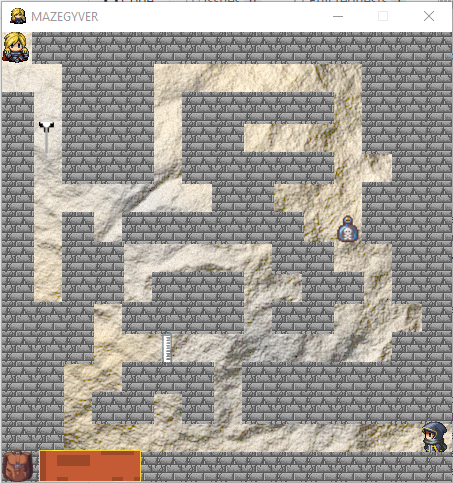
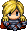
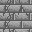
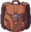
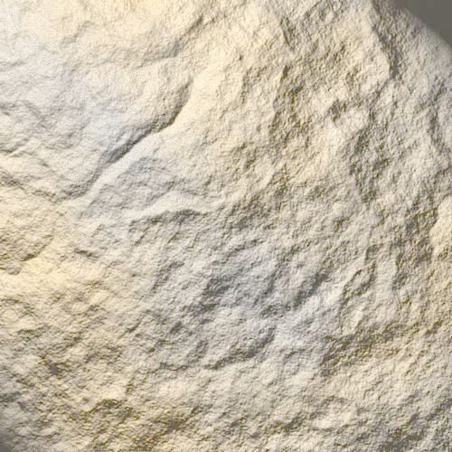
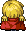
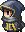
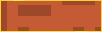
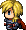
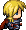

<h1 align="center"> MAZEGYVER</h1>

  
 

 <h2 align="center" style="color: green">
  Aidez MacGyver à s'échapper !
 </h2>

## Fonctionnalités
Il n'y a qu'un seul niveau. La structure (départ, emplacement des murs, arrivée), devra être enregistrée dans un fichier pour la modifier facilement au besoin.
MacGyver sera contrôlé par les touches directionnelles du clavier. :arrow_left: :arrow_up: :arrow_right: :arrow_down:
Les objets seront répartis aléatoirement dans le labyrinthe et changeront d’emplacement si l'utilisateur ferme le jeu et le relance.
La fenêtre du jeu sera un carré pouvant afficher 15 sprites sur la longueur.
MacGyver devra donc se déplacer de case en case, avec 15 cases sur la longueur de la fenêtre !
Il récupèrera un objet simplement en se déplaçant dessus.
Le programme s'arrête uniquement si MacGyver a bien récupéré tous les objets et trouvé la sortie du labyrinthe. S'il n'a pas tous les objets et qu'il se présente devant le garde, il meurt (la vie est cruelle pour les héros).
Le programme sera standalone, c'est-à-dire qu'il pourra être exécuté sur n'importe quel ordinateur.

## Contraintes
- Vous versionnerez votre code en utilisant Git et le publierez sur Github pour que votre mentor puisse le commenter,
- Vous respecterez les bonnes pratiques de la PEP 8 et développerez dans un environnement virtuel utilisant Python 3,
- Votre code devra être écrit en anglais : nom des variables, commentaires, fonctions...

## Compétences à valider
- Lire et comprendre une documentation de module
- Coder efficacement en utilisant les outils adéquats
- Utiliser un algorithme pour résoudre un besoin technique
- Gérer les différentes versions de Python et ses modules en fonction des projets
- Conceptualiser l'ensemble de son application en décrivant sa structure (Entités / Domain Objects)
- Créer des scripts pour le web en utilisant Python

# All Sprites

MacGyver | Maze | Loot | Bag | Background |
--- | --- | --- | --- | --- |
 **Down**|  **Wall**|  **Tube** |  |  |
 **Up**|  **Guardian**| **Ether** |  **In Bag**
 **Left**| |  **Needle**|
 **Right**|
